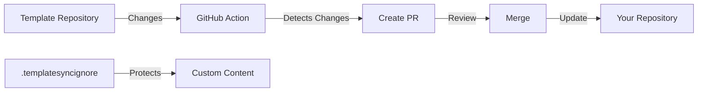

# Template Sync Setup - Changes Summary

## 📦 What Was Added

This document summarizes all files created to enable automatic template synchronization.

### ✅ GitHub Actions Workflows

#### 1. `.github/workflows/template-sync.yml`
**Purpose**: Automatic template synchronization

**Features**:
- Runs every Monday at 3 AM UTC
- Can be triggered manually via GitHub UI
- Creates PR when template changes detected
- Uses `.templatesyncignore` to protect custom content

**Triggers**:
- Schedule (cron): Every Monday at 3 AM UTC
- Manual (workflow_dispatch)
- Repository dispatch (webhook)

#### 2. `.github/workflows/template-sync-manual.yml`
**Purpose**: Manual sync with advanced options

**Features**:
- Choose source branch
- Custom PR labels
- Dry-run mode
- Full control over sync parameters

**Usage**: GitHub → Actions → Template Sync (Manual) → Run workflow

### 🛡️ Protection Configuration

#### 3. `.templatesyncignore`
**Purpose**: Protect custom content from being overwritten

**Protected Items**:
```
lessons/              # Your custom lessons
00-index.md          # Your custom index
sources.md           # Your custom sources
slides.md            # Your custom slides
node_modules/        # Dependencies
dist/                # Build artifacts
.env*                # Environment files
.vscode/, .idea/     # IDE settings
netlify.toml         # Deployment config
vercel.json          # Deployment config
og-image.png         # Custom images
```

### 📚 Documentation Files

#### 4. `.github/TEMPLATE_SYNC.md`
**Purpose**: Comprehensive template sync documentation

**Contents**:
- How template sync works
- Protected files explanation
- Manual sync instructions
- Configuration options
- Troubleshooting guide
- SSH setup for private repos

#### 5. `.github/SETUP_GUIDE.md`
**Purpose**: Step-by-step setup instructions

**Contents**:
- Overview of what was set up
- Getting started steps
- Configuration options (HTTPS vs SSH)
- Schedule customization
- Recommended workflow
- Detailed troubleshooting

#### 6. `.github/QUICK_REFERENCE.md`
**Purpose**: Quick command reference

**Contents**:
- Common commands
- Key files overview
- Protected content list
- Quick configuration snippets
- Troubleshooting quick fixes

#### 7. `.github/CHANGES_SUMMARY.md`
**Purpose**: This file - summary of all changes

#### 8. `.github/pull_request_template.md`
**Purpose**: PR template with sync checklist

**Features**:
- Standard PR fields
- Template sync specific checklist
- Verification steps for sync PRs

### 📝 Updated Files

#### 9. `README.md`
**Changes**: Added "Template Sync" section

**New Content**:
```markdown
## 🔄 Template Sync

This repository automatically syncs with the workshop-slides-template...
```

## 🎯 How It Works



### Workflow Process

1. **Scheduled Trigger**: Every Monday at 3 AM UTC
2. **Fetch Template**: Action fetches latest from template repo
3. **Compare**: Compares with your repository
4. **Filter**: Applies `.templatesyncignore` rules
5. **Create PR**: If changes found, creates labeled PR
6. **Review**: You review and test the changes
7. **Merge**: You merge when ready

## 🔧 Configuration Summary

### Current Settings

| Setting | Value |
|---------|-------|
| **Template Repository** | `git@github.com:workshops-de/workshop-slides-template.git` |
| **Template Branch** | `main` |
| **Sync Schedule** | Every Monday at 3 AM UTC |
| **PR Labels** | `template-sync`, `automated` |
| **PR Branch Prefix** | `template-sync-` |
| **Authentication** | SSH (configurable to HTTPS) |

### Customization Options

1. **Switch to HTTPS**: For public templates (simpler)
2. **Change Schedule**: Adjust cron expression
3. **Add Protected Files**: Edit `.templatesyncignore`
4. **Custom PR Labels**: Edit workflow files
5. **SSH for Private Repos**: Add deploy keys

## 📋 Next Steps

### Immediate Actions

- [ ] **Test the setup**: Run manual sync via GitHub Actions
- [ ] **Review first PR**: Check that protected files work correctly
- [ ] **Verify locally**: Test the synced changes

### Optional Configuration

- [ ] **Choose authentication**: Decide between SSH and HTTPS
- [ ] **Adjust schedule**: Change if Monday 3 AM doesn't work
- [ ] **Customize ignore list**: Add any additional protected files
- [ ] **Set up notifications**: Configure GitHub notifications for PRs

### For Private Templates

- [ ] **Generate SSH keys**: Create deploy key pair
- [ ] **Add public key**: To template repository
- [ ] **Add private key**: As GitHub secret
- [ ] **Update workflow**: Uncomment SSH key line

## 🎓 Learning Resources

### Documentation Files (Read in Order)

1. **QUICK_REFERENCE.md** - Start here for quick overview
2. **SETUP_GUIDE.md** - Detailed setup and configuration
3. **TEMPLATE_SYNC.md** - Complete reference documentation

### External Resources

- [actions-template-sync](https://github.com/AndreasAugustin/actions-template-sync) - Official documentation
- [GitHub Actions](https://docs.github.com/en/actions) - GitHub Actions docs
- [Cron Expressions](https://crontab.guru/) - Schedule generator

## 🔍 File Locations

```
spring-boot-slides/
├── .github/
│   ├── workflows/
│   │   ├── template-sync.yml           # Automatic sync
│   │   └── template-sync-manual.yml    # Manual sync
│   ├── TEMPLATE_SYNC.md                # Full documentation
│   ├── SETUP_GUIDE.md                  # Setup instructions
│   ├── QUICK_REFERENCE.md              # Quick reference
│   ├── CHANGES_SUMMARY.md              # This file
│   └── pull_request_template.md        # PR template
├── .templatesyncignore                 # Protection rules
└── README.md                           # Updated with sync info
```

## ✅ Verification Checklist

After setup, verify:

- [ ] Workflow files are in `.github/workflows/`
- [ ] `.templatesyncignore` exists and contains protected paths
- [ ] README.md mentions template sync
- [ ] Documentation files are accessible
- [ ] GitHub Actions are enabled for the repository
- [ ] Manual sync can be triggered
- [ ] First sync PR is created successfully

## 🎉 Benefits

### What You Get

✅ **Automatic Updates**: Receive template improvements automatically
✅ **Protected Content**: Your lessons stay safe
✅ **Version Control**: All changes via PR for review
✅ **Flexibility**: Manual trigger when needed
✅ **Transparency**: Full visibility of what changes
✅ **Safety**: Test before merging

### What's Protected

✅ **Your Work**: All custom lessons and content
✅ **Your Config**: Custom configuration files
✅ **Your Assets**: Custom images and resources
✅ **Your History**: Git history preserved

## 🤝 Contributing

If you improve the sync setup:

1. Update relevant documentation
2. Test changes thoroughly
3. Update this summary
4. Share improvements with template maintainers

## 📞 Support

Need help?

1. **Check documentation**: Start with QUICK_REFERENCE.md
2. **Review logs**: GitHub Actions → Select run → Logs
3. **Check issues**: actions-template-sync GitHub issues
4. **Ask maintainers**: Contact template repository maintainers

---

**Setup completed successfully! 🎉**

For next steps, see the "Next Steps" section above or read the [SETUP_GUIDE.md](SETUP_GUIDE.md).

