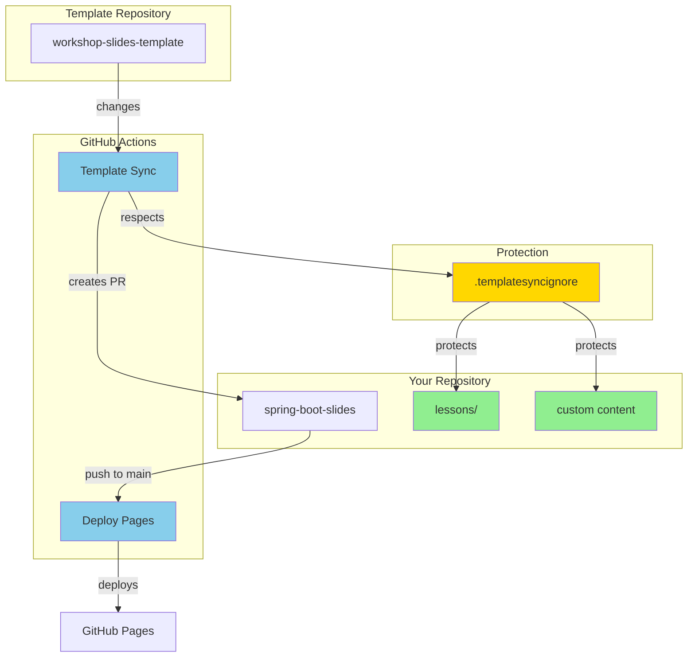

# GitHub Configuration

This directory contains GitHub-specific configuration files for the repository.

## 📁 Directory Structure

```
.github/
├── workflows/                      # GitHub Actions workflows
│   ├── deploy.yml                 # Deploy slides to GitHub Pages
│   ├── template-sync.yml          # Automatic template sync (scheduled)
│   └── template-sync-manual.yml   # Manual template sync (on-demand)
├── CHANGES_SUMMARY.md             # Summary of template sync setup
├── QUICK_REFERENCE.md             # Quick reference for common tasks
├── SETUP_GUIDE.md                 # Detailed setup instructions
├── TEMPLATE_SYNC.md               # Complete template sync documentation
├── pull_request_template.md       # PR template with checklists
└── README.md                      # This file
```

## 🔄 Workflows

### 1. Deploy Pages (`deploy.yml`)
**Purpose**: Build and deploy slides to GitHub Pages

**Triggers**:
- Push to `main` branch
- Manual via workflow_dispatch

**Actions**:
1. Install dependencies
2. Build all slides
3. Export PDFs
4. Deploy to GitHub Pages

### 2. Template Sync (`template-sync.yml`)
**Purpose**: Automatically sync with template repository

**Triggers**:
- Schedule: Every Monday at 3 AM UTC
- Manual via workflow_dispatch
- Repository dispatch webhook

**Actions**:
1. Fetch template changes
2. Apply `.templatesyncignore` rules
3. Create PR if changes detected

### 3. Template Sync Manual (`template-sync-manual.yml`)
**Purpose**: Manual sync with advanced options

**Triggers**:
- Manual via workflow_dispatch (with inputs)

**Options**:
- Choose source branch
- Custom PR labels
- Dry-run mode

## 📚 Documentation Files

### Quick Start
Start here: **[QUICK_REFERENCE.md](QUICK_REFERENCE.md)**
- Common commands
- Quick configuration snippets
- Troubleshooting quick fixes

### Setup & Configuration
For setup: **[SETUP_GUIDE.md](SETUP_GUIDE.md)**
- Step-by-step setup instructions
- Configuration options
- SSH vs HTTPS setup
- Detailed troubleshooting

### Complete Reference
For details: **[TEMPLATE_SYNC.md](TEMPLATE_SYNC.md)**
- How template sync works
- Protected files explanation
- Manual sync instructions
- Advanced configuration

### Changes Overview
What was added: **[CHANGES_SUMMARY.md](CHANGES_SUMMARY.md)**
- All files created
- Configuration summary
- Verification checklist

## 🎯 Quick Links

| Task | Action |
|------|--------|
| **Manual Sync** | Actions → Template Sync (Manual) → Run workflow |
| **Check Sync Status** | Actions → Template Sync → View runs |
| **Review Sync PR** | Pull Requests → Filter by `template-sync` label |
| **Deploy Slides** | Automatic on push to main |
| **View Deployed Slides** | Settings → Pages → Visit site |

## 🛡️ Template Sync Protection

The following content is protected from template sync:

✅ **Your Content**
- `lessons/` - All your custom lessons
- `00-index.md` - Your custom index
- `sources.md` - Your sources
- `slides.md` - Your slides

✅ **Configuration**
- `netlify.toml` - Deployment config
- `vercel.json` - Deployment config
- `.env*` - Environment files

✅ **Build Artifacts**
- `node_modules/` - Dependencies
- `dist/` - Build output
- `*.log` - Log files

See `.templatesyncignore` for complete list.

## 🔧 Common Tasks

### Test Template Sync Locally
```bash
# Fetch and checkout sync PR
git fetch origin
git checkout template-sync-<timestamp>

# Install and test
npm install
npm run dev
```

### Protect Additional Files
```bash
# Add to .templatesyncignore
echo "my-custom-file.md" >> ../.templatesyncignore
```

### Change Sync Schedule
Edit `workflows/template-sync.yml`:
```yaml
schedule:
  - cron: '0 3 * * 1'  # Every Monday 3 AM UTC
```

### Switch to HTTPS (Public Template)
Edit `workflows/template-sync.yml`:
```yaml
source_repo_path: https://github.com/workshops-de/workshop-slides-template.git
```

## 🔍 Troubleshooting

### Workflow Not Running
1. Check Actions tab is enabled
2. Verify workflow file syntax
3. Check repository permissions

### Sync Creates Conflicts
1. Checkout PR branch
2. Resolve conflicts manually
3. Push resolved changes

### Custom File Overwritten
1. Add file to `.templatesyncignore`
2. Restore from git history

For more help, see [TEMPLATE_SYNC.md](TEMPLATE_SYNC.md#-troubleshooting).

## 📊 Workflow Diagram



## 🎓 Learning Path

1. **Start**: Read [QUICK_REFERENCE.md](QUICK_REFERENCE.md) (5 min)
2. **Setup**: Follow [SETUP_GUIDE.md](SETUP_GUIDE.md) (15 min)
3. **Test**: Run manual sync via GitHub Actions
4. **Review**: Check first sync PR
5. **Reference**: Bookmark [TEMPLATE_SYNC.md](TEMPLATE_SYNC.md)

## 🤝 Contributing

When modifying workflows or sync configuration:

1. Test changes with manual trigger
2. Update relevant documentation
3. Update this README if structure changes
4. Document in [CHANGES_SUMMARY.md](CHANGES_SUMMARY.md)

## 📞 Support

Need help?

1. **Documentation**: Check files in this directory
2. **Logs**: Actions → Select run → View logs
3. **Issues**: Check template-sync GitHub issues
4. **Maintainers**: Contact template repository maintainers

---

**For quick help, start with [QUICK_REFERENCE.md](QUICK_REFERENCE.md)**

